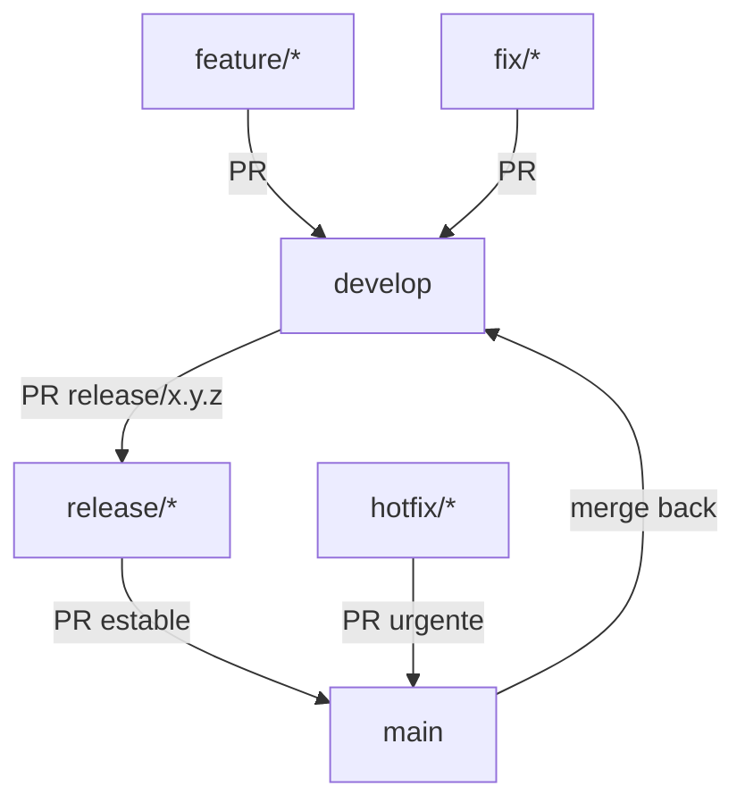

# Proyecto 🏥 Sistema de Gestión de Laboratorio Clínico

[](https://angular.io/)
[](https://www.typescriptlang.org/)
[](https://eslint.org/)
[](https://prettier.io/)

> **Sistema integral para la gestión de un laboratorio clínico** desarrollado con Angular 17+ siguiendo las mejores prácticas de desarrollo frontend.

## 🚀 Características Principales

Este proyecto utiliza un flujo de ramas controlado para garantizar calidad y orden en los despliegues.

---

## 🌳 Estructura de Ramas

- **`main`**
  - Rama de producción.
  - Solo recibe **PR desde `release/*`** (versionado de la app) o **PR desde `hotfix/*`** (urgencias en producción).
  - Está protegida: no se puede pushear directo, solo mediante Pull Request.

- **`develop`**
  - Rama de integración.
  - Los desarrolladores hacen PR aquí desde sus ramas de trabajo (`feature/*`, `bugfix/*`).
  - Acumula cambios que luego se liberan en `release/*`.

- **`feature/*`**
  - Ramas para nuevas funcionalidades.
  - Se crean desde `develop` y se fusionan a `develop`.

- **`fix/*`**
  - Ramas para correcciones menores detectadas durante desarrollo.
  - Se crean desde `develop` y se fusionan a `develop`.

- **`release/*`**
  - Ramas para preparar una nueva versión (ejemplo: `release/1.0.0`).
  - Se crean desde `develop`.
  - Se fusionan a `main` (producción) y luego a `develop` para mantener sincronía.

- **`hotfix/*`**
  - Ramas de emergencia para arreglos en producción.
  - Se crean desde `main` y se fusionan a `main` mediante PR.
  - Luego se hace merge de `main` → `develop` para mantener coherencia.

---

## 🔒 Reglas de Protección de Ramas

### `main`

- ✅ Requiere Pull Request antes de hacer merge.
- ✅ Requiere que los checks (GitHub Actions) pasen antes de mergear.
- ✅ Requiere estar actualizado con la última versión.
- ✅ No se permiten push directos.
- ✅ Solo se aceptan PR desde `release/*` o `hotfix/*`.

### `develop`

- ✅ Requiere Pull Request antes de hacer merge.
- ✅ Puede requerir checks (tests/lint/build).
- ✅ No se permiten push directos.

---

## 🔄 Flujo de Trabajo



---

## 📌 Ejemplo de uso

1. Crear rama para nueva funcionalidad:

   ```bash
   git checkout develop
   git pull origin develop
   git checkout -b feature/nueva-funcionalidad
   ```

2. Subir cambios y abrir PR → `develop`.

3. Cuando `develop` esté estable, crear rama de release:

   ```bash
   git checkout develop
   git pull origin develop
   git checkout -b release/1.0.0
   ```

   Luego abrir PR → `main` y PR → `develop`.

4. En caso de urgencia en producción:

   ```bash
   git checkout main
   git pull origin main
   git checkout -b hotfix/arreglo-urgente
   ```

   Luego abrir PR → `main` y merge de `main` → `develop`.

## 🚀 Características principales

- **Angular 19** - Framework frontend moderno y potente
- **Arquitectura modular** - Estructura organizada por características (feature modules)
- **Lazy Loading** - Carga optimizada de módulos bajo demanda
- **PrimeNG** - Componentes UI ricos y accesibles
- **Sistema Mock Data** - Desarrollo sin backend con datos de ejemplo
- **GitHub Actions** - CI/CD integrado
- **Análisis estático** - ESLint y Stylelint para mantener la calidad del código
- **Optimizado para deployment** - Configurado para Netlify y GitHub Pages

## 🛠️ Requisitos previos

- Node.js 20.x LTS (recomendado)
- npm 10.x o superior
- Angular CLI (instalación global con `npm install -g @angular/cli`)

## 📂 Estructura del proyecto

```
src/
├── app/
│   ├── core/                 # Servicios singleton, guards, interceptores
│   ├── feature-groups/       # Módulos de características agrupadas
│   │   ├── analytical-management/  # Gestión de análisis clínicos
│   │   ├── appointments-results/   # Gestión de turnos y resultados
│   │   ├── billing-collections/    # Facturación y cobranza
│   │   ├── care-management/        # Gestión de atención
│   │   ├── coverage-administration/# Administración de coberturas
│   │   ├── patients/               # Gestión de pacientes
│   │   ├── procurement-inventory/  # Compras e inventario
│   │   └── user-management/        # Gestión de usuarios
│   │
│   ├── shared/                # Componentes, directivas y pipes reutilizables
│   │   ├── components/        # Componentes compartidos
│   │   ├── models/            # Interfaces y tipos
│   │   └── services/          # Servicios compartidos
│   │
│   ├── app.component.*        # Componente raíz
│   ├── app.config.ts          # Configuración de la aplicación
│   └── app.routes.ts          # Rutas principales
│
├── assets/                # Recursos estáticos (imágenes, fuentes, etc.)
└── environments/          # Configuraciones de entorno
```

## 🛠️ Configuración de Estilos

La aplicación utiliza Angular Material para los componentes de UI. Los estilos globales se encuentran en `src/styles.css`.

### Estructura de estilos

- **Globales**: `src/styles.css`
- **Por componente**: Cada componente tiene sus propios estilos en archivos `.css`

## 🚀 Comandos útiles

### Instalación y configuración

```bash
# Instalar dependencias
npm ci

# Instalar Angular CLI globalmente (si no lo tienes)
npm install -g @angular/cli
```

### Desarrollo local

```bash
# Desarrollo con Angular dev server
npm start
# o
npm run dev

# La aplicación estará disponible en http://localhost:4200
# Por defecto usa datos MOCK (sin necesidad de backend)
```

### 🎭 Modo Mock Data (Desarrollo sin Backend)

El proyecto incluye un sistema completo de datos mock que simula una API REST:

```typescript
// src/environments/environment.ts
useMockData: true  // ← Activado por defecto en desarrollo
```

**Datos de ejemplo incluidos:**
- 5 proveedores con contactos
- 8 productos/insumos de laboratorio
- 5 órdenes de compra con diferentes estados

Ver `MOCK_DATA_GUIDE.md` para más detalles sobre cómo usar y extender el sistema mock.

### Análisis y calidad de código

```bash
# Ejecutar ESLint
npm run lint

# Corregir problemas de formato automáticamente
npm run format

# Verificar formato sin hacer cambios
npm run format:check
```

### 🛠️ Configuración de ESLint en WebStorm

#### Sigue estos pasos para integrar ESLint en WebStorm y visualizar errores de linting directamente en el editor:

- Ve a File > Settings > Languages & Frameworks > JavaScript > Code Quality Tools > ESLint.
- Selecciona la opción Automatic ESLint configuration.

#### Si prefieres configurarlo manualmente:

- Marca la casilla Manual ESLint configuration.
- En ESLint package, selecciona el paquete ESLint instalado en tu proyecto (node_modules/eslint).
- En Configuration file, selecciona el archivo de configuración de ESLint (.eslintrc.\*).
- Activar análisis de linting

- Asegúrate de que la casilla Run for files esté habilitada y configurada para los archivos relevantes (_.ts, _.js, etc.).
- Haz clic en Apply y luego en OK.
- Ver errores de linting en tiempo real
- WebStorm mostrará los errores de ESLint directamente en el editor (subrayados en rojo o amarillo).
- También puedes ver un resumen de los errores en la ventana Problems (Alt + 6 en Windows).
- Ejecutar ESLint manualmente

### Construcción para producción

```bash
# Construir para producción (general)
npm run build

# Construir para Netlify
npm run build:netlify

# Construir para GitHub Pages
npm run build:gh-pages

# Servir la versión de producción localmente (requiere http-server)
npm install -g http-server
cd dist/2025-piv-tpi-lcc-fe/browser
http-server
```

## 🚀 Deployment

### Netlify

1. Conecta tu repositorio en Netlify
2. La configuración está en `netlify.toml`
3. Build automático al hacer push a `main`
4. **Importante**: Configura la variable de entorno `apiUrl` en Netlify apuntando a tu backend real

### GitHub Pages

1. Habilita GitHub Pages en Settings > Pages
2. Selecciona "GitHub Actions" como source
3. El workflow `.github/workflows/deploy-gh-pages.yml` se ejecuta automáticamente
4. Tu sitio estará disponible en `https://<usuario>.github.io/<repo>/`

### Configuración del Backend

En ambos casos, debes configurar la URL del backend en producción:

```typescript
// src/environments/environment.production.ts
export const environment = {
  production: true,
  apiUrl: 'https://tu-backend-api.com/api' // URL de tu backend real
};
```

## 🔄 Flujo de trabajo con Git

1. Crear una rama para tu característica:

   ```bash
   git checkout -b feature/nombre-de-la-caracteristica
   ```

2. Hacer commits con mensajes descriptivos:

   ```bash
   git commit -m "feat: agregar funcionalidad X"
   ```

3. Hacer push a tu rama:

   ```bash
   git push origin feature/nombre-de-la-caracteristica
   ```

4. Crear un Pull Request (PR) en GitHub para revisión

## 📚 Recursos para estudiantes

### Aprender Angular

- [Documentación oficial de Angular](https://angular.io/docs)
- [Tour of Heroes Tutorial](https://angular.io/tutorial)
- [Angular Material](https://material.angular.io/)

### Herramientas útiles

- [TypeScript](https://www.typescriptlang.org/)
- [RxJS](https://rxjs.dev/)
- [Angular CLI](https://cli.angular.io/)

## 🔧 Configuración avanzada

### Variables de entorno

El proyecto utiliza archivos de entorno para configurar la URL del backend:

- **Desarrollo**: `src/environments/environment.ts`
- **Producción**: `src/environments/environment.production.ts`

Ejemplo:

```typescript
export const environment = {
  production: false,
  apiUrl: 'http://localhost:8080/api' // Backend de desarrollo
};
```

### Personalización del entorno de desarrollo

- Ajusta `apiUrl` según tu backend local
- Para producción, configura la URL del backend real en `environment.production.ts`
- Nunca expongas secretos o tokens en el código frontend

### Normas de trabajo por grupos (muy importante)

- Cada grupo trabaja únicamente dentro de su feature
- No modificar código de otros grupos, ni `app.routes.ts` excepto si se acuerda un cambio transversal con docentes.
- Las rutas hijas se agregan en el `*.routes.ts` del grupo. Evitar dependencias cruzadas entre grupos.
- En PRs: no agregar librerías (está bloqueado modificar `package.json`), mantener estilo (ESLint/Prettier) y seguir el template de PR.

### Seguridad: conceptos clave y referencias

- **HTTPS/TLS**: cifra el tráfico entre cliente y servidor. En despliegue real, habilitar HTTPS y preferir HSTS.
  - Referencia: [Mozilla: Server Side TLS](https://wiki.mozilla.org/Security/Server_Side_TLS)
- **Reverse proxy / API proxy**: el FE sólo llama a `/api`, el proxy reenvía a servicios internos. Oculta hosts reales y centraliza CORS, rate limit y logs.
  - Referencia: [NGINX Reverse Proxy](https://docs.nginx.com/nginx/admin-guide/web-server/reverse-proxy/)
- **CORS**: restringe orígenes que pueden consumir la API desde el navegador. Configurar `origin` explícito en el proxy.
  - Referencia: [MDN CORS](https://developer.mozilla.org/docs/Web/HTTP/CORS)
- **CSP (Content-Security-Policy)**: limita orígenes de scripts, estilos, imágenes, etc. Reduce riesgos de XSS.
  - Referencia: [MDN CSP](https://developer.mozilla.org/docs/Web/HTTP/CSP)
- **Security headers**: `X-Frame-Options` (anti clickjacking), `X-Content-Type-Options` (no sniff), `Referrer-Policy`, `Permissions-Policy`.
  - Referencia: [OWASP Secure Headers Project](https://owasp.org/www-project-secure-headers/)
- **Rate limiting**: limita peticiones por ventana de tiempo para evitar abuso. Implementado con `express-rate-limit`.
  - Referencia: [express-rate-limit](https://www.npmjs.com/package/express-rate-limit)
- **Gestión de secretos**: nunca exponer tokens/keys en el FE. Usar variables de entorno en el proxy/CI.
  - Referencia: [OWASP Secrets Management](https://cheatsheetseries.owasp.org/cheatsheets/Secrets_Management_Cheat_Sheet.html)
- **Cookies de sesión**: usar `HttpOnly`, `Secure`, `SameSite=Strict` cuando corresponda.
  - Referencia: [OWASP Session Management](https://cheatsheetseries.owasp.org/cheatsheets/Session_Management_Cheat_Sheet.html)
- **Source maps**: deshabilitados en producción. Evita filtrar código fuente.
  - Referencia: [Angular source maps](https://angular.dev/tools/cli/build)
- **Validación/Autorización en backend**: toda regla de negocio sensible debe validarse en el servidor (el FE no es confiable).
  - Referencia: [OWASP ASVS](https://owasp.org/www-project-application-security-verification-standard/)

#### Buenas Prácticas para Componentes Reutilizables

1. **Props/Inputs claros**: Define interfaces TypeScript para los inputs
2. **Eventos bien definidos**: Usa `@Output()` para comunicación con el componente padre
3. **Estilos encapsulados**: Usa `ViewEncapsulation` apropiadamente
4. **Documentación**: Incluye comentarios JSDoc para el componente y sus métodos públicos
5. **Responsabilidad única**: Cada componente debe tener una única responsabilidad
6. **Composición**: Crea componentes pequeños y compónlos para crear interfaces más complejas

#### Ejemplo de Estructura de un Componente Reutilizable

```
components/
  mi-componente/
    ├── mi-componente.component.ts      # Lógica del componente
    ├── mi-componente.component.html    # Plantilla
    ├── mi-componente.component.scss    # Estilos
    ├── mi-componente.component.spec.ts # Pruebas unitarias
    └── README.md                      # Documentación de uso
```


### Calidad de código y CI

- Lint:

```bash
npm run lint
```

- Formato:

```bash
npm run format
```

- PR Checks:
  - Bloquea cambios a `package.json`/`package-lock.json`
  - Build, Lint, Test (tests opcionales)
  - Falla el PR si hay errores de ESLint

### Release (imágenes Docker)

- Al hacer push en `main` se construyen y publican imágenes en GHCR:
  - `ghcr.io/<org>/<repo>/frontend:latest`
  - `ghcr.io/<org>/<repo>/api-proxy:latest`

### Scripts útiles

```bash
npm ci                    # instalar deps
npm start                 # Angular dev server (4200)
npm run dev               # Angular dev server (4200)
npm run lint              # eslint
npm run lint:fix          # eslint auto-fix
npm run lint:styles       # stylelint
npm run lint:styles:fix   # stylelint auto-fix
npm run build             # build prod
npm run build:netlify     # build para Netlify
npm run build:gh-pages    # build para GitHub Pages
```

### Añadir rutas hijas a un grupo (ejemplo)

Edita `src/app/feature-groups/g01/g01.routes.ts`:

```ts
export const g01Routes: Routes = [
  { path: '', component: G01HomeComponent },
  { path: 'nueva', component: NuevaPantallaComponent },
];
```

### Troubleshooting

- `ECONNREFUSED /api/*`: verifica que el backend esté corriendo y la URL en `environment.ts` sea correcta
- Puerto 4200 ocupado: cambia el puerto con `ng serve --port <puerto>` o libera el proceso
- Errores de build: ejecuta `npm ci` para reinstalar dependencias limpias
- Node 23 experimental: se recomienda Node 20 LTS

### Contribución

- Usa el template `.github/pull_request_template.md`
- Abrí el PR como Draft, revisá los artifacts de calidad y marcá la checklist
- No cambies `package.json`/`package-lock.json` en PRs (lo instala el maintainer)


By HJM :)
